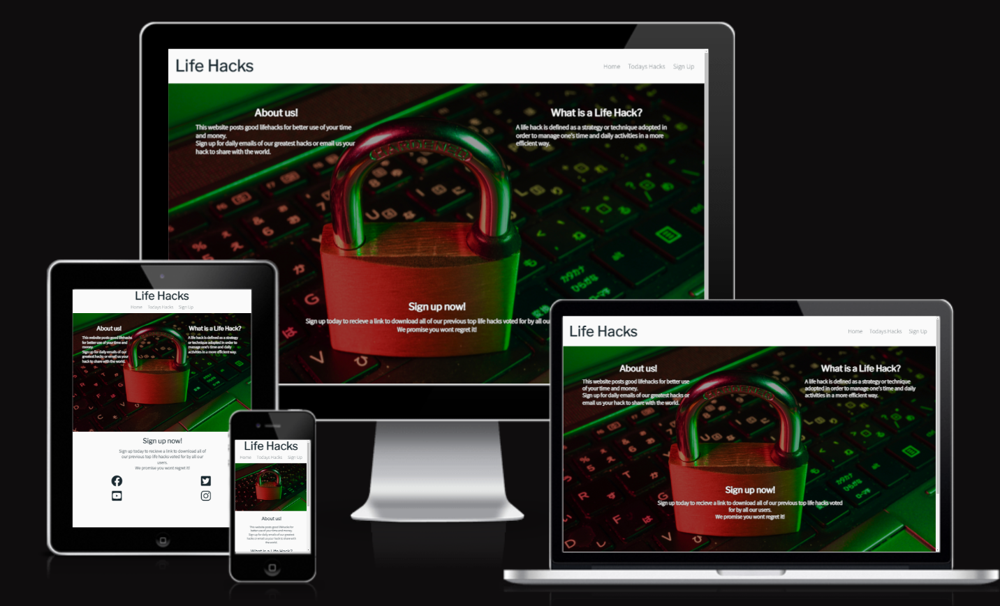
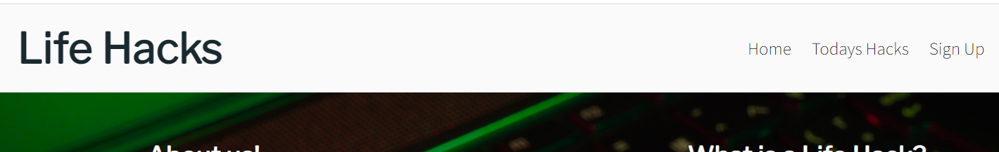
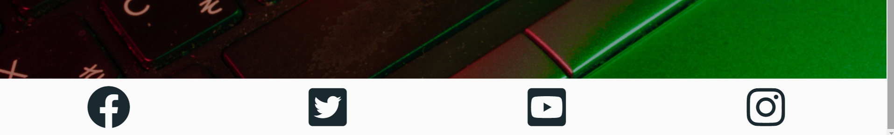
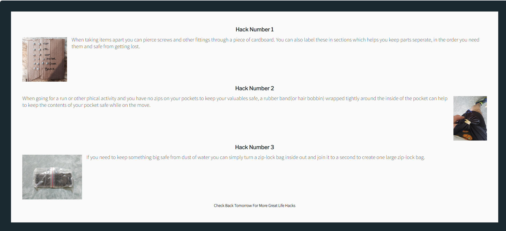
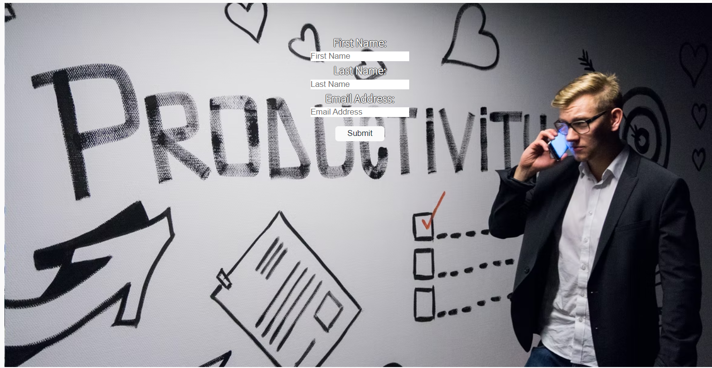
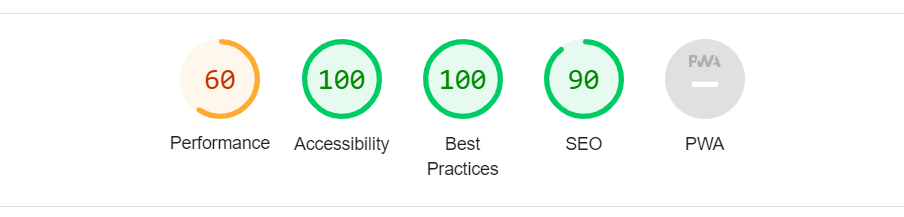

# Lifehacks

This website is aimed at people looking to make the most out their recources in life. Whether it is making your money stretch further to fit a budget, making daily tasks quicker and more efficient to free up time in the day or even to find some lifehacks you never even knew you needed, this is the website for you.

Here we have a selection of our top tips hand picked daily that we feel will benefit all, users can also sign up for extra content emailed daily and weekly. Users can also email in their own lifehacks for a chance to make our top hacks on a day.

## Features
- ### Header
  - Featured on all pages this header displays the name of our site and a navigation bar to give users quick and easy access to any page they need on the website.

- ### Main image with text overlay
  - The main image on our landing page shows a padlock on a keyboard with text overlaying the image at certain viewport sizes. This text gives a basic understanding of what this website does and what a lifehack is to prevent any confusion from users.

- ### Footer
  - The footer is used across all pages on the site and contains clickable icons which will bring the users to their social media accounts.

- ### Todays Hack contents
  - This page on the website shows the main content of the site. The page shows 3 life hacks with pictures and explaining text to go with each all surrounded by a border.

  

- ### Sign-up page
  - This is the sign-up page on the website which has a short form and submit button over an image.

## Features not implemented
- A much larger content section, seperated into categories for easier navigation
- A search function to search for keywords 
- A comment section for users to comment on content on the website

## Testing
- The website has been tested using Chrome, Edge and Firefox
- The website has been tested and is working on all different screen sizes

## Validator Testing
- HTML
  - The W3C validator origionally showed that there was an extra closing </i> tag in all the social media icons but after this was fixed showed no additional errors
- CSS
  - The W3C validator showed no errors in the CSS file

## Bugs and Issues
 - The main issue on the site was the text over the images when scaling down in viewport sizes. The images on the wesite are quite dark so white text was appropriate but as the screen size scaled down the text moved over some lighter parts of the image and became hard to read. Lots of fixes were tried like including filtering the image to become darker and applying a darker box around the text to make the text stand out. In the end the brightness was reduced in the background image and the white text was given a black border using text-shadow to make it stand out even if it did pass over a lighter part of the image.

 ## Accessibility
 - The accessibility of the website was tested using lighthouse and got a score of 100

 

 - NOTE: A performance score of 60 was given in this test which I will be investigating further

 ## Deployment 
- ### Deployed using GitHub pages
  - On the GitHub repository page navigate to settings
  - In the settings menu find the pages tab
  - On this page under build and deployment menu select main as the branch and hit save to begin page deployment

## Credits
- ### Content
  - The icons came from font awesome.
  - The html code for the social media links in the footer section was taken from the Code Institute Love Running project
  - The content for the lifehacks was taken from Reddit r/lifehacks

- ### Media
  - The images for the lifehacks was taken from Reddit r/lifehacks
  - The images on the landing page and sign-up page are open source and was sorced from unsplash.com